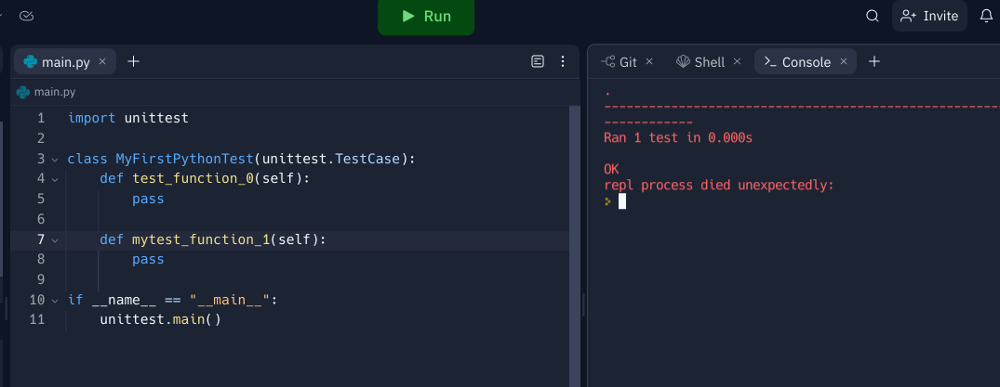

# try-unittest

For me to get practice using `unittest`.

## Naming test functions 

Remember to include `self`.

Remember to have `test` as the prefix for the test function names, otherwise they will not be included properly, as shown below:

Despite having 2 functions, only one has the prefix `test`, and so only one is included in the testing process. 
